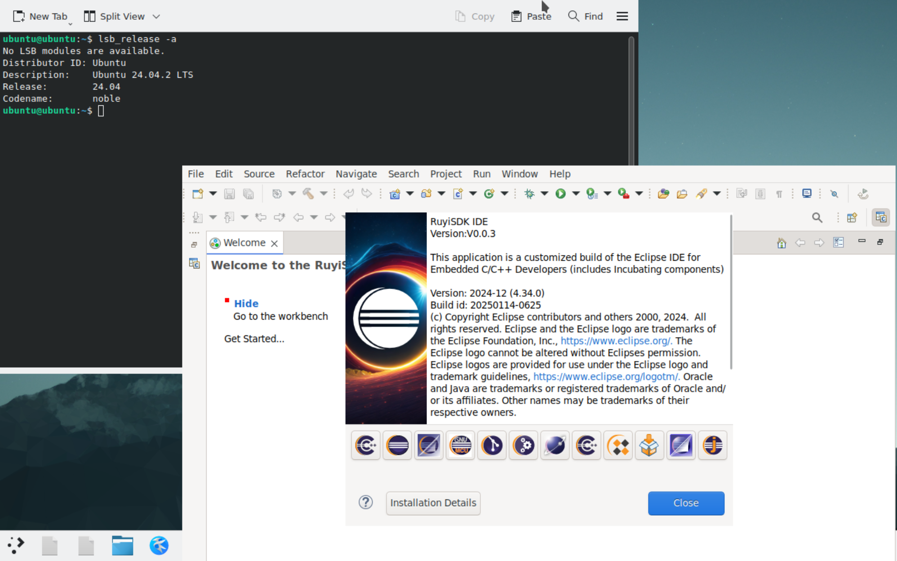
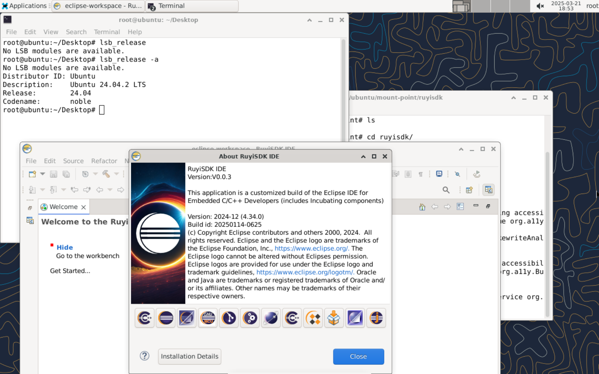
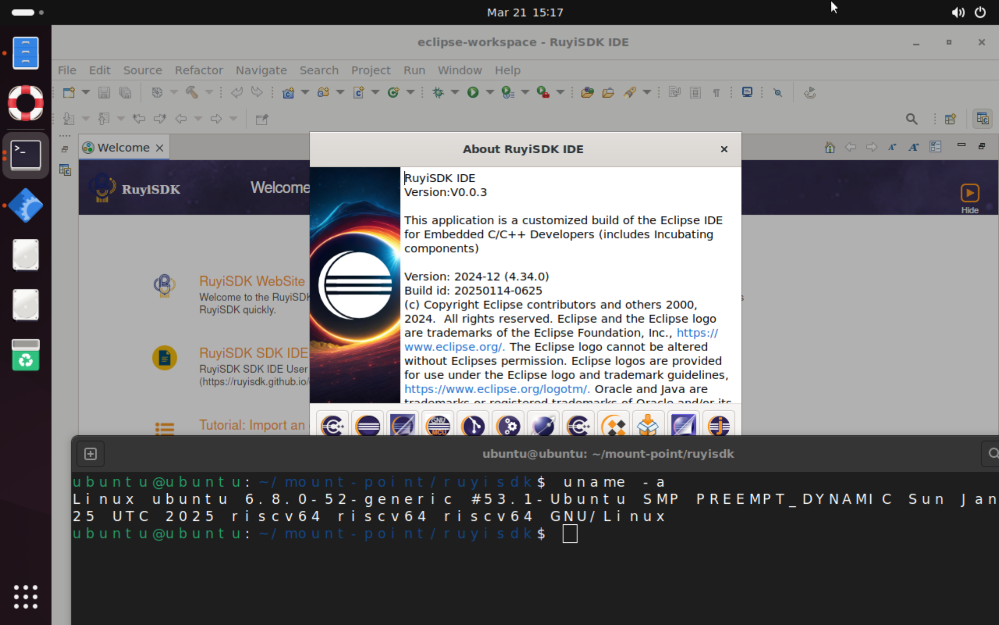
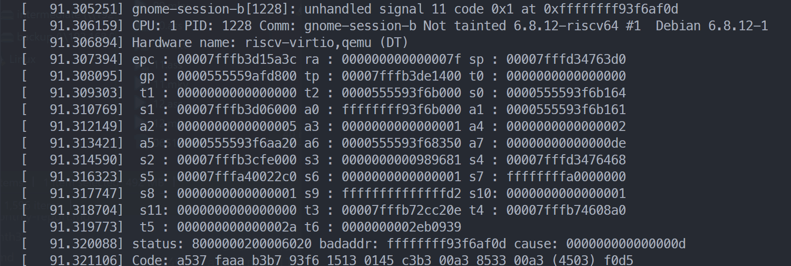
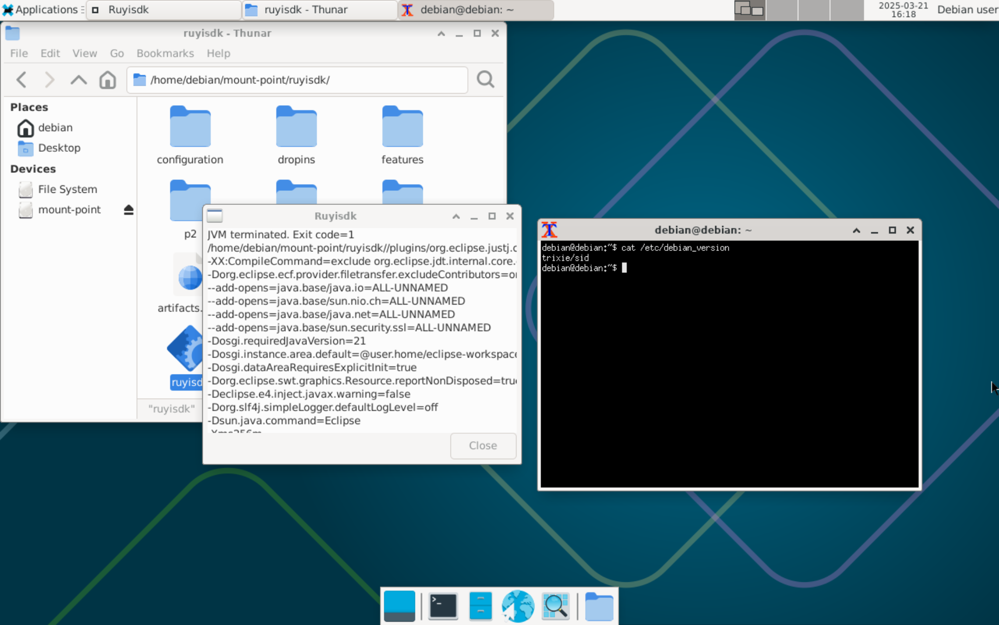
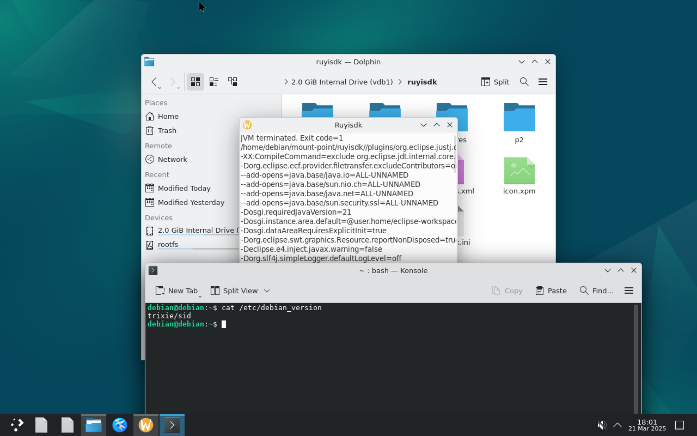
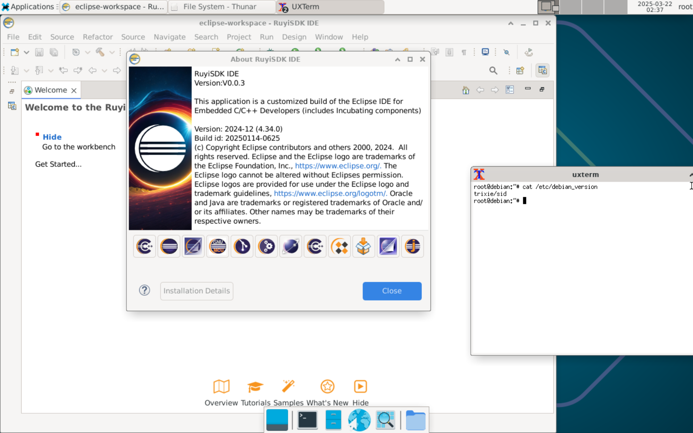
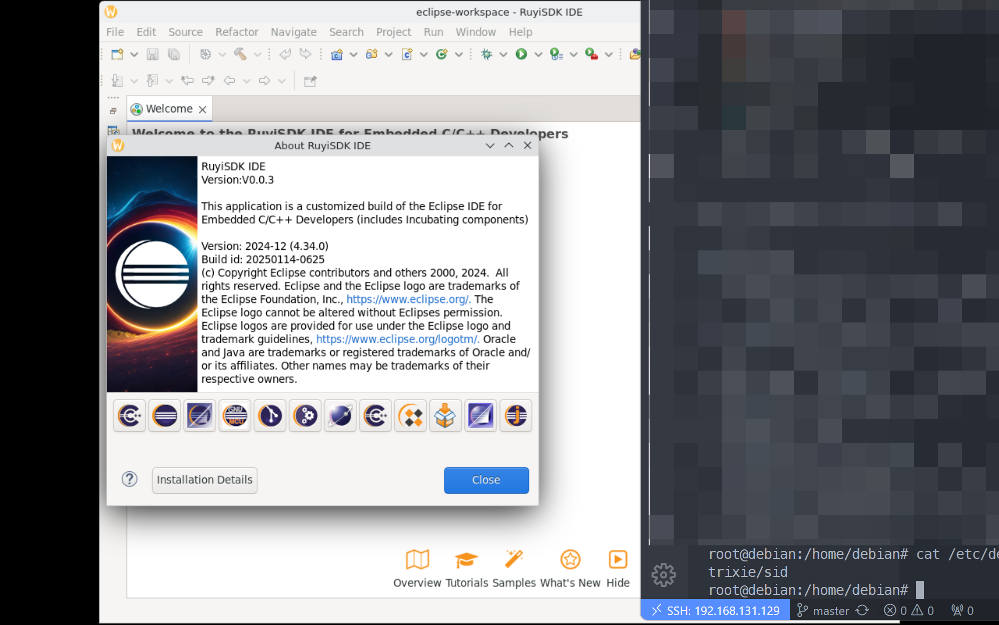
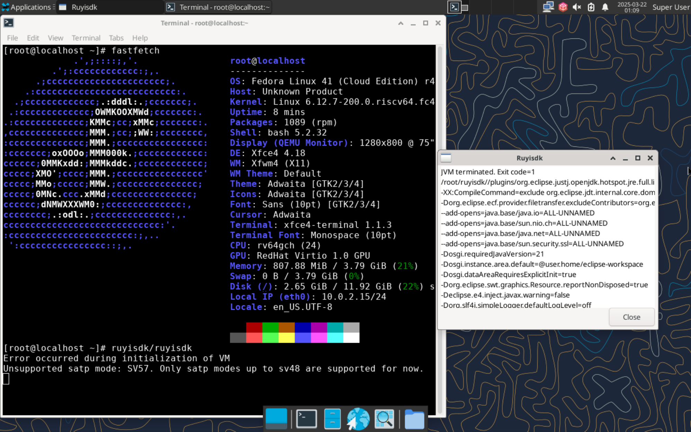
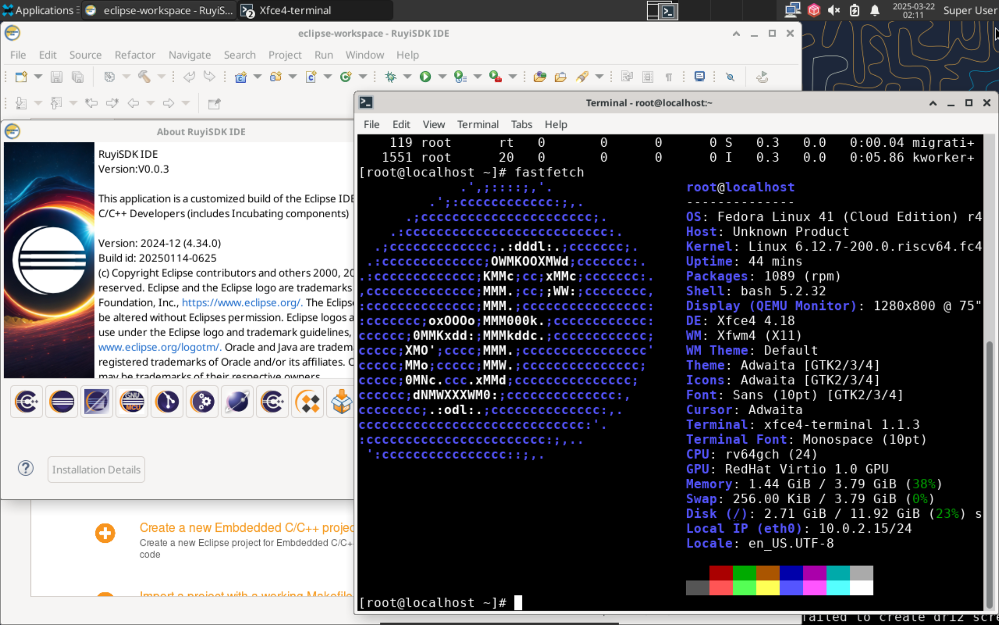

# 周报

- 进行了 RuyiSDK IDE 0.0.3 在不同发行版的 riscv64 架构下的运行测试

---

## 测试报告

RuyiSDK IDE 0.0.3 在不同发行版的 riscv64 架构下的运行测试

|                    | Xfce | GNOME | KDE |
| :----------------: | :--: | :---: | :-: |
| Ubuntu 24.04.2 LTS |  √   |   √   |  √  |
|  openEuler 24.03   |  ×   |       |     |
|     Debian sid     |  !   |   ⚠   |  !  |
|     Fedora 41      |  !   |   ⚠   |  ⚠  |

⚠：系统不支持该桌面环境  
!: sv57=off 下可以运行

---

另外测试了 `eclipse-cpp-2025-03-R-linux-gtk-riscv64` 在 Debian sv57 和 openEuler sv57 下运行，发现也无法正常启动，报错一致；

测试了 `eclipse-cpp-2025-03-R-linux-gtk-riscv64` 在 openEuler 非 sv57 下也不能正常启动，报错一致。

---

### Ubuntu





### Debian







### Fedora

> 自行编译 qemu 9  
> `-cpu rv64,sv57=off \`  
> 加入参数后可以运行




### openEuler 24.03 xfce

```bash
bash-5.2$ /ruyisdk
CompileCommand:exclude org/eclipse/idt/internal/core/dom/rewrite/ASTRewriteAnayzer.getExtendedRange bool exclude = true
Jan 15,2025 10:54:08 AM org.apache.aries.spifly.BaseActivator log
INF0: Registered provider org.slf4j.simple.SimpleServiceProvider of service orgslf4j.spi.SLF4JServiceProvider in bundle slf4j.simple
/home/openeuler/ruyisdk//plugins/org.eclipse.justi.openidk.hotspot.jre.full.linux,riscy64 21.0,5,20241023-1957/jre/bin/java: symbol lookup error: /home/openeuler/ruyisdk/configuration/org,eclipse.osgi/548/0/.cp/libswt-pi3-gtk-4967r8.so: undefined symbol:g_once_init_enter_pointer
```
