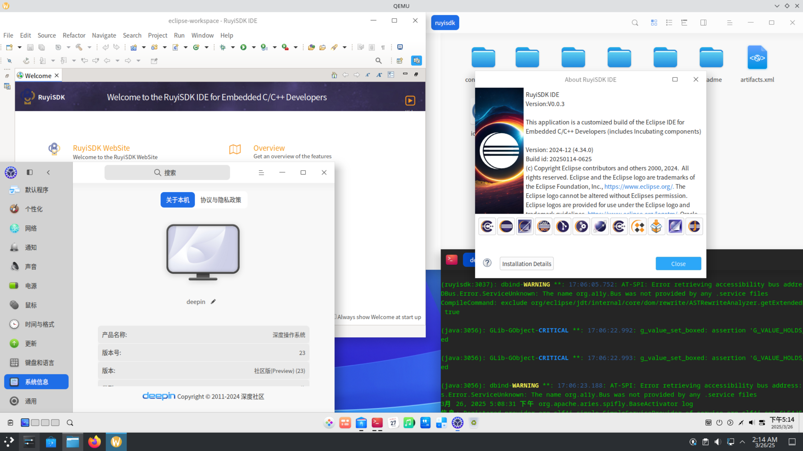
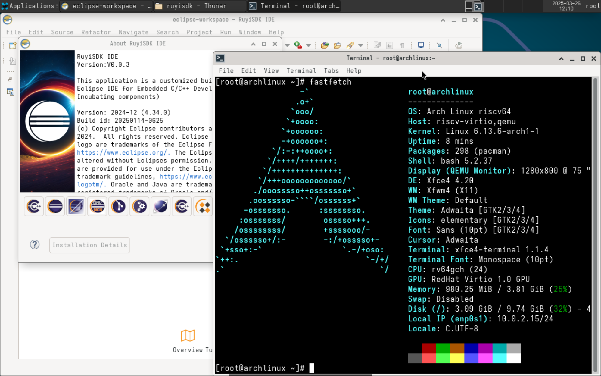
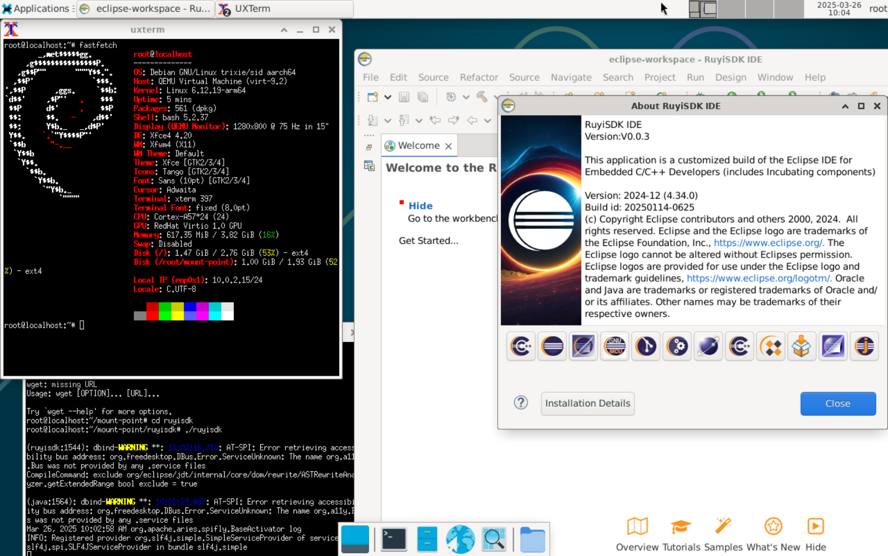

# 周报

- 进行了 RuyiSDK IDE 0.0.3 在不同发行版的 riscv64 架构下的运行测试

---

## 测试报告

RuyiSDK IDE 0.0.3 在不同发行版的 riscv64 架构下的运行测试

|                  | Xfce |
| :--------------: | :--: |
|    Deepin 23     |  √   |
|    Arch Linux    |  √   |
| Debian sid arm64 |  √   |

### Deepin 23

### Arch Linux

### Debian sid arm64

