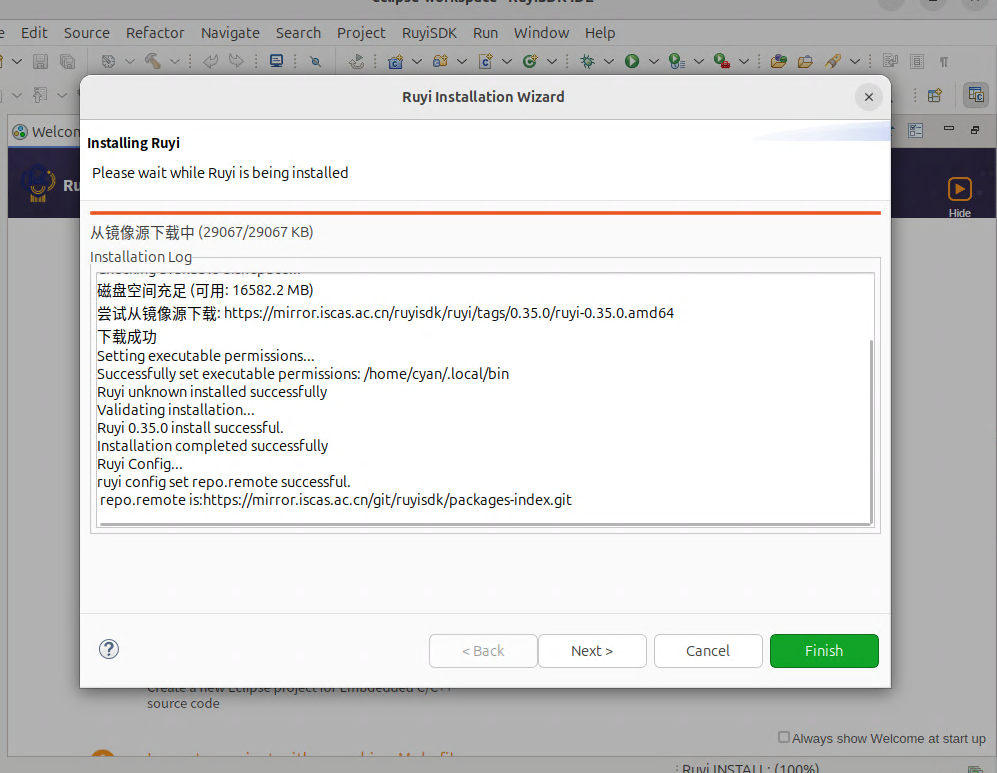
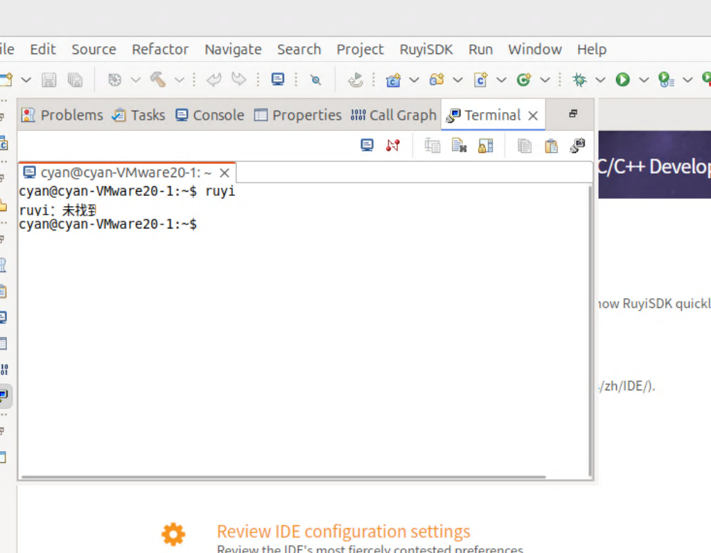
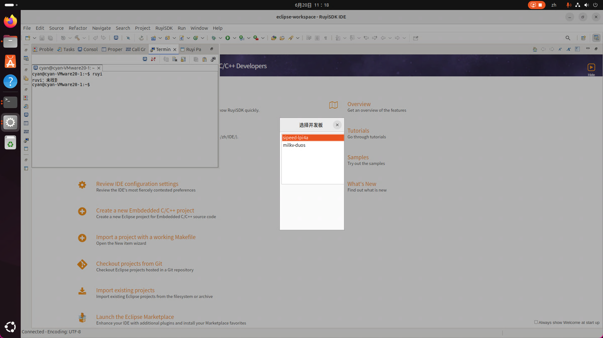

# 周报

- PR [docs/#86](https://github.com/ruyisdk/docs/pull/86) 更新 Ruyi IDE 安装教程

- 测试了 ruyi ide 0.0.5 版本，发现了如下问题，[测试报告](https://gitee.com/weilinfox/ruyisdk-test/pulls/6)：

1. 下载完成不够明显 [ruyisdk-eclipse-plugins/#39](https://github.com/ruyisdk/ruyisdk-eclipse-plugins/issues/39)：

2. 未配置 PATH 导致无法轻松访问 ruyi，希望可以有替代解决方案，如安装完提示，或者只修改当前进程的 PATH [ruyisdk-eclipse-plugins/#38](https://github.com/ruyisdk/ruyisdk-eclipse-plugins/issues/38)

3. 新加的 Package Resource Management -> “Windows > Show View > Other > Other > Ruyi Package Explorer“ 有窗口大小问题，而且不易找到，可以添加到菜单栏里 [ruyisdk-eclipse-plugins/#37](https://github.com/ruyisdk/ruyisdk-eclipse-plugins/issues/37)

